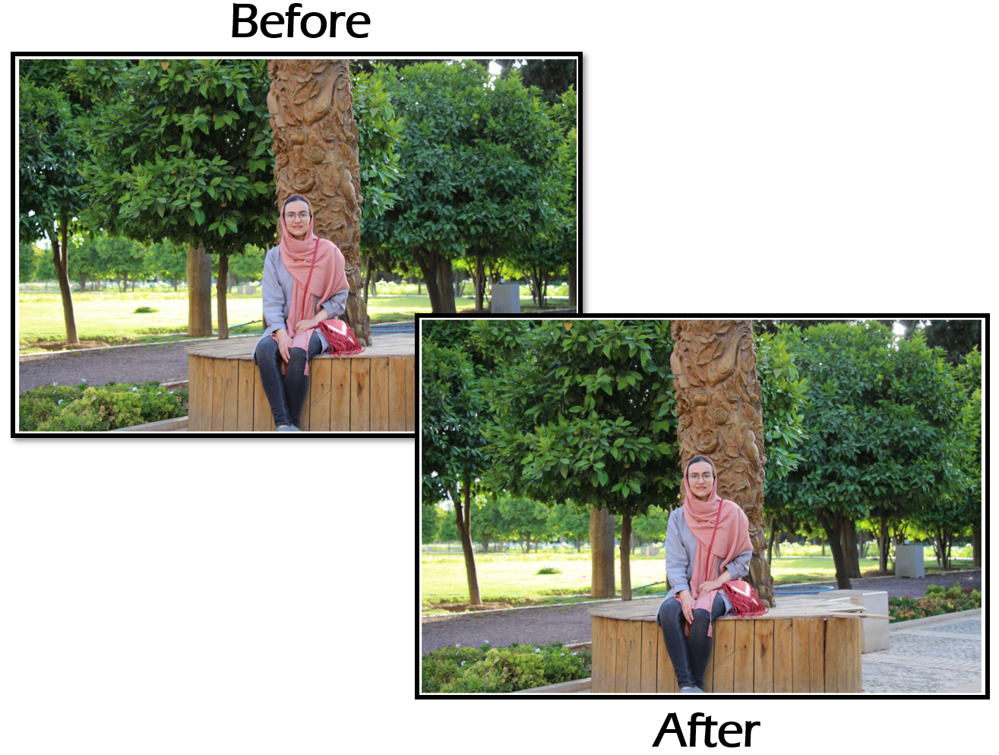

# Compressing Images using Cosine Transform

This is a Python project that demonstrates image compression using the Discrete Cosine Transform (DCT) and quantization. The DCT is applied to 8x8 blocks of the image, and quantization is used to reduce the amount of data required to represent each block. The compressed image is then decompressed to recover the original image.

## Prerequisites

Make sure you have the following Python libraries installed:

- `numpy`
- `PIL` (Pillow)
- `matplotlib`
  
## Algorithm Overview

The project performs the following steps:

1. Load an input image.
2. Separate the image into its RGB color channels.
3. Apply scaling by subtracting 127 from each color channel.
4. Perform a 2D Discrete Cosine Transform (DCT) on 8x8 blocks of each color channel.
5. Quantize the DCT coefficients using a predefined quantization matrix.
6. Compress the quantized coefficients by run-length encoding.
7. Decompress the run-length encoded data to obtain the quantized coefficients.
8. Perform the inverse quantization.
9. Apply the inverse DCT to recover the transformed blocks.
10. Mix the color channels back together.
11. Show the original and reconstructed images.
12. Calculate the distance between the original and reconstructed images.

## Note

- The compression rate and zeros rate are calculated and displayed as metrics.
- The distance between the original and reconstructed images is calculated using the L2 norm.

# Example

